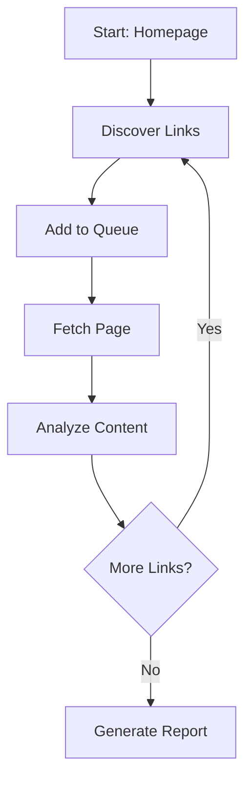

## Overview

Before diving into Link Health Monitor's features, it's helpful to understand the core concepts that power the platform. This page explains the key terminology and how different components work together.

## Domains

A **domain** represents a website you want to monitor. Each domain is a unique property in your Link Health Monitor account.

<Info>
  Domains must be verified before crawling to ensure you have permission to analyze the site. This protects website owners from unauthorized scanning.
</Info>

### Domain Properties

| Property | Description |
|----------|-------------|
| **URL** | The root domain (e.g., `example.com`) |
| **Verification Status** | Whether domain ownership has been confirmed |
| **Last Crawled** | When the most recent crawl completed |
| **Health Score** | Overall link health rating (0-100) |

### Subdomains

Each subdomain is treated as a separate domain:
- `example.com` → One domain
- `blog.example.com` → Separate domain
- `shop.example.com` → Separate domain

<Tip>
  If you need to monitor multiple subdomains, add each one individually and verify ownership for each.
</Tip>

## Crawls

A **crawl** is an automated scan of your domain that discovers and analyzes links. The crawler starts from your homepage and follows links to map your entire site structure.

### How Crawling Works

### Crawl States

| State | Description |
|-------|-------------|
| **Queued** | Crawl is waiting to start |
| **Running** | Actively discovering and checking links |
| **Completed** | All discovered links have been checked |
| **Failed** | Crawl encountered an unrecoverable error |
| **Cancelled** | User manually stopped the crawl |

### Crawl Depth

Crawl depth determines how many "clicks" from the homepage the crawler will follow:

- **Depth 1**: Only the homepage
- **Depth 2**: Homepage + pages linked from homepage
- **Depth 3**: Two levels of link-following
- **Unlimited**: Follow all discoverable links

<Warning>
  Higher depths take longer and discover more pages. For large sites, start with a limited depth to estimate total page count.
</Warning>

## Links

A **link** is any URL discovered during a crawl. Links are categorized by type and status.

### Link Types

<CardGroup cols={2}>
  <Card title="Internal Links" icon="house">
    Links pointing to pages on the same domain. These form your site's navigation structure.
  </Card>
  <Card title="External Links" icon="arrow-up-right-from-square">
    Links pointing to other domains. These are checked for availability but not crawled further.
  </Card>
</CardGroup>

### Link Status Codes

| Category | Codes | Meaning |
|----------|-------|---------|
| **Success** | 200-299 | Link works correctly |
| **Redirect** | 300-399 | Link redirects to another URL |
| **Client Error** | 400-499 | Broken link (404 not found, 403 forbidden, etc.) |
| **Server Error** | 500-599 | Target server is experiencing issues |
| **Timeout** | — | Server didn't respond in time |

## Scan Options

**Scan options** are additional analyses you can enable during a crawl. Each option adds specific checks beyond basic link validation.

<AccordionGroup>
  <Accordion title="SSL Check" icon="lock">
    Verifies SSL/TLS certificate validity and checks expiration dates. Warns you 30, 14, and 7 days before certificates expire.
    
    **Available on**: All plans
  </Accordion>
  
  <Accordion title="SEO Analysis" icon="magnifying-glass">
    Analyzes on-page SEO factors including:
    - Meta titles and descriptions
    - Heading hierarchy (H1-H6)
    - Image alt text
    - Viewport meta tag
    - Language attributes
    
    **Available on**: Solo plan and above
  </Accordion>
  
  <Accordion title="Anchor Text Analysis" icon="font">
    Evaluates the quality of link anchor text:
    - Detects generic text ("click here", "read more")
    - Identifies empty anchors
    - Flags image links without alt text
    - Scores descriptive quality
    
    **Available on**: Pro plan and above
  </Accordion>
  
  <Accordion title="Response Trends" icon="chart-line">
    Tracks response times across multiple crawls to identify:
    - Performance degradation
    - Slow resources
    - Patterns over time
    
    **Available on**: Pro plan and above
  </Accordion>
</AccordionGroup>

## AI Reviews

**AI Reviews** provide intelligent analysis of your crawl results using advanced language models. Instead of just listing issues, AI Reviews:

- Prioritize fixes by impact
- Explain why issues matter
- Provide specific code fixes
- Identify patterns across your site

<Note>
  AI Reviews are available on Pro and Agency plans with monthly limits based on your subscription.
</Note>

### Review Components

| Component | Description |
|-----------|-------------|
| **Health Score** | Overall site health rating (0-100) |
| **Critical Issues** | High-priority problems requiring immediate attention |
| **Quick Wins** | Easy fixes with significant impact |
| **Code Fixes** | Ready-to-implement HTML/code snippets |
| **Recommendations** | Strategic improvements for long-term health |

## Health Score

The **Health Score** is a 0-100 rating that summarizes your domain's overall link health. Higher scores indicate fewer issues and better performance.

### Score Calculation

The score weighs multiple factors:

| Factor | Weight | Impact |
|--------|--------|--------|
| Broken links (4xx) | High | -5 points per broken link |
| Server errors (5xx) | High | -3 points per error |
| Redirect chains | Medium | -1 point per excessive chain |
| Missing SEO elements | Medium | -0.5 points per issue |
| SSL issues | High | -10 points if expired/invalid |
| Response time | Low | -0.1 points per slow page |

### Score Ranges

| Range | Rating | Meaning |
|-------|--------|---------|
| 90-100 | Excellent | Site is healthy with minimal issues |
| 70-89 | Good | Some issues exist but nothing critical |
| 50-69 | Fair | Multiple issues need attention |
| 0-49 | Poor | Significant problems affecting users and SEO |

## Reports

**Reports** are exportable summaries of crawl results. They can be shared with team members, clients, or stakeholders who don't have direct platform access.

### Report Formats

- **Web Link**: Shareable URL with optional password protection
- **PDF Export**: Formatted document for presentations
- **CSV Export**: Raw data for spreadsheet analysis

<Tip>
  Agency plan users can generate white-labeled reports with custom branding.
</Tip>

## What's Next?

Now that you understand the core concepts, explore specific features:

<CardGroup cols={2}>
  <Card
    title="Broken Link Detection"
    icon="link-slash"
    href="/features/broken-link-detection"
  >
    Learn how to find and fix broken links.
  </Card>
  <Card
    title="Adding Domains"
    icon="plus"
    href="/domains/adding-domains"
  >
    Add and configure your first domain.
  </Card>
</CardGroup>

